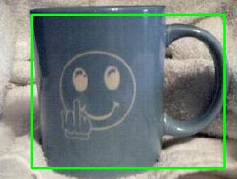
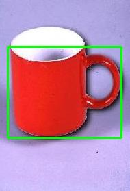

# Object Detection

Object detection with **Dlib**.

**Caltech 101** is a dataset for object detection. The images of the objects belonging to 101 categories[[1](http://www.vision.caltech.edu/Image_Datasets/Caltech101/)].

## Environment

Ubuntu 16.04

Python 3.5 and site-packages:

    pip install scipy scikit-image dlib opencv-contrib-python 

## Example

HOG_Caltech_101.ipynb: using HOG to detect the object.

## Result

HOG_Caltech_101.ipynb:

## Reference

[1] [Caltech 101](http://www.vision.caltech.edu/Image_Datasets/Caltech101/)

[2] [https://www.learnopencv.com/histogram-of-oriented-gradients/](https://www.learnopencv.com/histogram-of-oriented-gradients/)